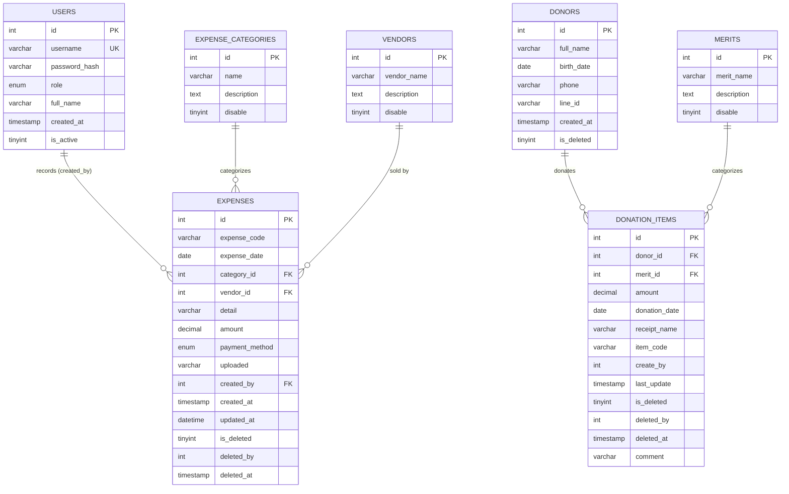

# ER Diagram — ระบบบริหารการเงินวัดพระธรรมกายยามานาชิ (yamafinance)
# Entity Relationship Diagram — Yama Finance (Wat Phra Dhammakaya Yamanashi)

ฐานข้อมูล `yamafinance` มี 7 ตาราง: `users`, `donors`, `merits`, `donation_items`, `expenses`, `expense_categories`, `vendors`
Database has 7 tables. Two fact tables — **`donation_items`** (income) and **`expenses`** (expense) — sit at the center, linked to dimension/master tables.

> **หมายเหตุ / Note:** ไม่มี FK constraint จริง (Storage engine = MyISAM) — ความสัมพันธ์ผูกในระดับ query (JOIN) เท่านั้น
> There are **no real FK constraints** (MyISAM engine); relationships are enforced only at the query/JOIN level.
> ทุกตารางใช้ soft-delete: `is_deleted` หรือ `disable`
> Every table uses soft-delete via `is_deleted` / `disable`.

---

## Mermaid ER Diagram



---

## ASCII ER Diagram (fallback for plain-text viewers)

```
                         ┌──────────────┐
                         │   USERS      │
                         │ (id PK)      │
                         └──────┬───────┘
                                │ 1
                                │ records (created_by)
                                │ N
        ┌───────────────────────┴───────────────────────┐
        │                  EXPENSES                       │
        │ (id PK, expense_code, expense_date, amount,     │
        │  payment_method, uploaded, created_by,          │
        │  is_deleted, ...)                               │
        └───┬───────────────────────┬────────────────────┘
            │ N                     │ N
   category │ categorizes           │ sold by
            │ 1                     │ 1
   ┌────────┴─────────┐    ┌────────┴─────────┐
   │ EXPENSE_         │    │   VENDORS        │
   │ CATEGORIES       │    │ (id PK,          │
   │ (id PK, name,    │    │  vendor_name,    │
   │  description,    │    │  description,    │
   │  disable)        │    │  disable)        │
   └──────────────────┘    └──────────────────┘

        ┌──────────────┐
        │   DONORS      │
        │ (id PK,       │
        │  full_name,   │
        │  is_deleted)  │
        └──────┬───────┘
               │ 1
               │ donates
               │ N
   ┌───────────┴───────────────┐      ┌──────────────┐
   │     DONATION_ITEMS          │ N   │   MERITS      │
   │ (id PK, amount,             │───▶│ (id PK,       │
   │  donation_date,             │ 1  │  merit_name,  │
   │  receipt_name, item_code,   │cat │  description, │
   │  create_by, is_deleted, ...)│    │  disable)     │
   └────────────────────────────┘     └──────────────┘
```

---

## ความสัมพันธ์สรุป (Relationship Summary)

| ตารางหลัก (Fact) | เชื่อมกับ (Links to) | ผ่านฟิลด์ (Via) | ความสัมพันธ์ |
|---|---|---|---|
| `donation_items` (รายรับ) | `donors` | `donor_id` | ผู้นำบุญ 1 คน มีบริจาคได้หลายรายการ |
| `donation_items` | `merits` | `merit_id` | บุญ 1 ประเภท มีบริจาคได้หลายรายการ |
| `expenses` (รายจ่าย) | `expense_categories` | `category_id` | ประเภท 1 รายการ มีรายจ่ายได้หลายรายการ |
| `expenses` | `vendors` | `vendor_id` | ร้านค้า 1 แห่ง มีรายจ่ายได้หลายรายการ (อาจว่าง) |
| `expenses` | `users` | `created_by` | ผู้ใช้ 1 คน บันทึกรายจ่ายได้หลายรายการ |

*ดูรายละเอียดคอลัมน์ครบถ้วนใน `SYSTEM_DOCUMENTATION.md` หัวข้อ 2.2*
