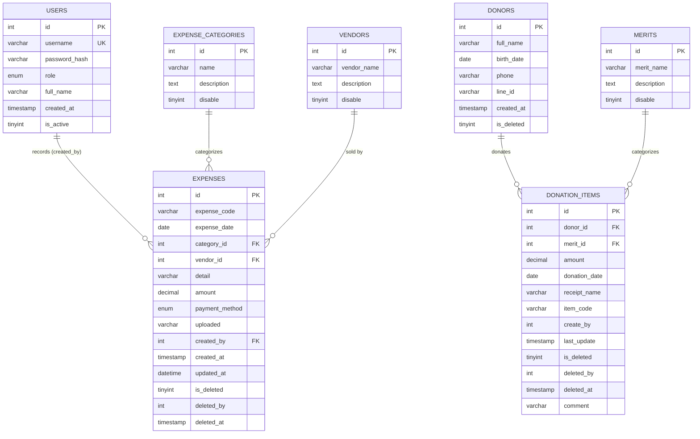

# เอกสารระบบบริหารการเงิน วัดพระธรรมกายยามานาชิ
# Yama Finance — System Documentation (Wat Phra Dhammakaya Yamanashi)

> **สองภาษา / Bilingual:** เนื้อหาเขียนเป็นภาษาไทยเป็นหลัก พร้อมคำอธิบาย/ศัพท์เทคนิคภาษาอังกฤษในวงเล็บและหัวข้อย่อย เพื่อให้ AI ใดก็ตาม (รวมถึงโมเดลที่อ่านภาษาอังกฤษ) สามารถเข้าใจและทำงานต่อได้ทันที
> **Primary language:** Thai, with English technical notes throughout so any AI assistant can read and continue the work.
>
> **ระดับเอกสาร / Doc level:** สถาปัตยกรรม + แพตเทิร์น (Architecture + Patterns) — ครอบคลุมโครงสร้าง ฐานข้อมูล สิทธิ์ ประวัติหน้า และแพตเทิร์นการทำงาน ไม่ได้คัดลอกซอร์สทุกบรรทัด แต่มีตัวอย่างโค้ดสำคัญพอให้เริ่มทำงานได้
> **ข้อมูลความลับ / Secrets:** ปกปิดค่าจริงทั้งหมด (ดูส่วน [9. ความปลอดภัย](#9-ความปลอดภัยและปัญหาทราบแล้ว-security--known-issues)) — ระบุเฉพาะตำแหน่งไฟล์และแนวทางแก้ไข

---

## 0. บทสรุปผู้บริหาร (Executive Summary)

ระบบ **yamafinance** คือแอปพลิเคชันเว็บสำหรับ **จัดการเงินของวัดพระธรรมกายยามานาชิ** (วัดไทยในจังหวัดยามานาชิ ประเทศญี่ปุ่น) ครอบคลุม:

- **ระบบบริจาค (Donations):** รับบันทึกเงินบริจาคจากผู้นำบุญ (donors) แยกตาม "บุญ" (merits) พร้อมเลขอ้างอิงและใบเสร็จ
- **ระบบรายจ่าย (Expenses):** บันทึกรายจ่าย แบ่งตามประเภท (categories) และร้านค้า/บริษัท (vendors) พร้อมอัปโหลดรูปใบเสร็จ
- **หน้าสรุป (Reports):** สรุปรายรับ-รายจ่าย รายเดือน/ไตรมาส/ปี ตามบุญ / ตามผู้นำบุญ / ตามประเภท พร้อม Export Excel (.xlsx)
- **จัดการผู้ใช้ (Users):** admin / accountant / data_entry

**ประเภทสถาปัตยกรรม:** PHP แบบกระบวนวิธี (procedural) ไม่ใช้ framework ไม่มี MVC ทุกหน้าเป็นไฟล์ PHP แยกกันใน `public/`, ใช้ MySQLi, หน้าบ้านใช้ Bootstrap 5 + Bootstrap Icons + Bootstrap-Select + Chart.js + jQuery โหลดจาก CDN, ภาษาไทย, สกุลเงิน **เยน (JPY)**.

---

## 1. สถาปัตยกรรมระบบ (System Architecture)

### 1.1 โครงสร้างโฟลเดอร์ (Folder Structure)

```
Z:\yamafinance\
│
├── config\
│   └── db_connect.php          ← เชื่อมต่อฐานข้อมูล (mysqli)  **มีรหัส DB แบบ hardcode (ดูหัวข้อ 9)**
│
├── includes\
│   ├── auth.php                ← session_start(), check_login(), require_role()
│   └── navbar.php              ← เมนูนำทางส่วนบน (รวมลิงก์ทุกหน้า)
│
├── public\                     ← DOCROOT ของเว็บเซิร์ฟเวอร์ (วางให้เรียกได้ผ่าน http)
│   ├── index.php               ← หน้าเข้าสู่ระบบ (login)
│   ├── dashboard.php           ← หน้าหลักหลังล็อกอิน
│   ├── *.php                   ← หน้าทำงานทั้งหมด (~67 ไฟล์)
│   ├── assets\
│   │   ├── logo.png            ← โลโก้วัด (932 KB)
│   │   ├── css\                ← ว่างเปล่า (CSS ทั้งหมดมา từ CDN / inline)
│   │   └── js\                 ← ว่างเปล่า (JS ทั้งหมดมา từ CDN / inline)
│
├── uploads\
│   └── receipts\               ← รูปใบเสร็จที่อัปโหลด (ตั้งชื่อ YYYYMM-XXX.ext)
│
├── yamafinance.sql             ← สำรองโครงสร้าง+ข้อมูลฐานข้อมูล (phpMyAdmin dump)
├── CHANGELOG_2026-07-17.md     ← บันทึกงานที่ทำล่าสุด
├── yamafinance.code-workspace  ← ไฟล์ workspace ของ VS Code
├── SYSTEM_DOCUMENTATION.md     ← ไฟล์นี้
├── claude.exe                  ← ⚠️ ไม่ใช่ส่วนของแอป (เป็นไบนารี Claude Code CLI ที่อยู่ในโฟลเดอร์โปรเจกต์ โดยบังเอิญ) ไม่ต้องสนใจเมื่อดูแลระบบนี้
└── .claude\
    └── settings.json           ← ⚠️ ตั้งค่า Claude Code (มี API token — ดูหัวข้อ 9)
```

### 1.2 เทคโนโลยี (Tech Stack)

| ชั้น (Layer) | เทคโนโลยี | หมายเหตุ |
|---|---|---|
| ภาษา (Language) | PHP (รองรับ **PHP 5.6** ขึ้นไป — ห้ามใช้ `??` null coalescing, ให้ใช้ `isset()`) | เซิร์ฟเวอร์จริงรัน PHP 5.6.40 |
| ฐานข้อมูล (DB) | MySQL 5.1 / MyISAM, เชื่อมผ่าน **MySQLi** (procedural style) | โครงสร้างส่งออกจาก MariaDB/MySQL 5.1.73 |
| หน้าบ้าน (Frontend) | Bootstrap 5.3.3, Bootstrap Icons 1.11.3 | ทั้งหมดโหลดจาก **CDN** (jsdelivr) |
| ตัวเลือกพิเศษ (Select) | Bootstrap-Select 1.14.0-beta3 + **jQuery 3.6.0** | ต้องโหลด jQuery **ก่อน** bootstrap-select |
| กราฟ (Charts) | Chart.js (CDN) | ใช้เฉพาะหน้าสรุป (pie chart) |
| Excel export | สร้าง `.xlsx` เองด้วย **ZipArchive + XML** (ไม่ใช้ library) | ดูหัวข้อ 6.9 |
| Auth | PHP session + `password_hash()` / `password_verify()` | bcrypt |

> **ไม่มี (Missing):** ไม่มี composer, ไม่มี framework, ไม่มี .htaccess routing, ไม่มี ORM, ไม่มี env file (config ถูก hardcode).

### 1.3 การเรียกหน้า (Routing)

ไม่มีเราเตอร์กลาง ทุกหน้าเข้าถึงได้โดยตรงผ่านพาธไฟล์ เช่น `http://host/public/donations.php` navbar และ dashboard ลิงก์ไป `/public/...` เสมอ แก้ชื่อโฟลเดอร์หรือย้ายไฟล์ต้องแก้ลิงก์ใน `includes/navbar.php`, `public/index.php`, `public/dashboard.php` ด้วย

### 1.4 การเก็บความลับ (Secret Handling) — สรุป

| ไฟล์ | 内容 (What) | สถานะ |
|---|---|---|
| `config/db_connect.php` | รหัสผู้ใช้/รหัสผ่านฐานข้อมูล | **hardcode ค่าไว้จริง — ให้ย้ายไป env/ไฟล์นอก DOCROOT (ดู 9)** |
| `.claude/settings.json` | `ANTHROPIC_AUTH_TOKEN` (API key ของ Claude) | **เป็นค่าจริง — ไม่อยู่ใน scope ของแอปเว็บ, ไม่ควรแชร์** |

---

## 2. ฐานข้อมูล (Database)

ฐานข้อมูลชื่อ `yamafinance` มี **7 ตาราง** ทุกตารางใช้ **soft-delete** (คอลัมน์ `is_deleted` / `disable`) — ข้อมูลไม่ถูกลบจริง แต่กำหนดธงเพื่อซ่อน

### 2.1 แผนภาพความสัมพันธ์ (Entity Relationship Diagram)

> มีให้เลือก 2 รูปแบบ: **Mermaid** (กราฟิก เรนเดอร์บน GitHub / markdown viewer ส่วนใหญ่) และ **ASCII** (อ่านได้ใน markdown ธรรมดา)

#### Mermaid ER Diagram


#### ASCII ER Diagram (fallback)
```
                         ┌──────────────┐
                         │   USERS      │
                         │ (id PK)      │
                         └──────┬───────┘
                                │ 1
                                │ records (created_by)
                                │ N
        ┌───────────────────────┴───────────────────────┐
        │                  EXPENSES                       │
        │ (id PK, expense_code, expense_date, amount,     │
        │  payment_method, uploaded, created_by,          │
        │  is_deleted, ...)                               │
        └───┬───────────────────────┬────────────────────┘
            │ N                     │ N
   category │ categorizes           │ sold by
            │ 1                     │ 1
   ┌────────┴─────────┐    ┌────────┴─────────┐
   │ EXPENSE_         │    │   VENDORS        │
   │ CATEGORIES       │    │ (id PK,          │
   │ (id PK, name,    │    │  vendor_name,    │
   │  description,    │    │  description,    │
   │  disable)        │    │  disable)        │
   └──────────────────┘    └──────────────────┘

        ┌──────────────┐
        │   DONORS      │
        │ (id PK,       │
        │  full_name,   │
        │  is_deleted)  │
        └──────┬───────┘
               │ 1
               │ donates
               │ N
   ┌───────────┴───────────────┐      ┌──────────────┐
   │     DONATION_ITEMS          │ N   │   MERITS      │
   │ (id PK, amount,             │───▶│ (id PK,       │
   │  donation_date,             │ 1  │  merit_name,  │
   │  receipt_name, item_code,   │cat │  description, │
   │  create_by, is_deleted, ...)│    │  disable)     │
   └────────────────────────────┘     └──────────────┘
```

- `donation_items` คือตารางรายการบริจาค (แกนกลางของรายรับ) เชื่อม `donors` (donor_id) + `merits` (merit_id)
- `expenses` คือตารางรายจ่าย เชื่อม `expense_categories` (category_id) + `vendors` (vendor_id) + `users` (created_by — ผู้บันทึก)
- **ไม่มี FK constraint จริง** (MyISAM) — การผูกความสัมพันธ์ทำในระดับ query (JOIN) เท่านั้น
- ทุกตารางใช้ **soft-delete**: `is_deleted` (donors/donation_items/expenses) หรือ `disable` (merits/expense_categories/vendors)

### 2.2 รายละเอียดตาราง (Table Details)

#### `users` — ผู้ใช้งานระบบ
| คอลัมน์ | ชนิด | ค่าแนะนำ | หมายเหตุ |
|---|---|---|---|
| id | int(11) PK AUTO_INCREMENT | | |
| username | varchar(50) UNIQUE | | ชื่อล็อกอิน |
| password_hash | varchar(255) | | bcrypt (`$2y$...`) |
| role | enum('admin','accountant','data_entry') | | สิทธิ์ |
| full_name | varchar(100) | | ชื่อแสดง |
| created_at | timestamp | | |
| is_active | tinyint(1) DEFAULT 1 | | 0 = ถูกปิดการใช้งาน |

#### `donors` — ผู้นำบุญ (ผู้บริจาค)
| คอลัมน์ | ชนิด | หมายเหตุ |
|---|---|---|
| id | int(11) PK | |
| full_name | varchar(255) NOT NULL | ชื่อผู้นำบุญ |
| birth_date | date NULL | |
| phone | varchar(50) NULL | |
| line_id | varchar(100) NULL | ID ไลน์ |
| created_at | timestamp | |
| is_deleted | tinyint(1) DEFAULT 0 | soft-delete |

#### `merits` — รายการบุญ (ประเภทการทำบุญ เช่น ตักบาตร, บูชาข้าวพระ)
| คอลัมน์ | ชนิด | หมายเหตุ |
|---|---|---|
| id | int(11) PK | |
| merit_name | varchar(255) NOT NULL | ชื่อบุญ |
| description | text NULL | |
| disable | tinyint(1) DEFAULT 0 | 1 = ปิดการใช้งาน (toggle) |

#### `donation_items` — รายการบริจาค (แกนกลางรายรับ)
| คอลัมน์ | ชนิด | หมายเหตุ |
|---|---|---|
| id | int(11) PK | |
| donor_id | int(11) NOT NULL | FK → donors.id |
| merit_id | int(11) NOT NULL | FK → merits.id |
| amount | decimal(10,2) NOT NULL | จำนวนเงิน (เยน) |
| donation_date | date NOT NULL | |
| receipt_name | varchar(255) NULL | "ชื่อบนใบโม" — อาจต่างจากชื่อผู้นำบุญ |
| item_code | varchar(50) NOT NULL | เลขอ้างอิงระบบ เช่น `2/5/12` (donor/merit/seq) |
| create_by | int(11) NOT NULL | ผู้บันทึก |
| last_update | timestamp | |
| is_deleted | tinyint(1) DEFAULT 0 | soft-delete |
| deleted_by | int(11) NULL | |
| deleted_at | timestamp NULL | |
| comment | varchar(255) NULL | หมายเหตุ |

#### `expense_categories` — ประเภทรายจ่าย (90 รายการ เช่น "010 ครุภัณฑ์หนัก…")
| คอลัมน์ | ชนิด | หมายเหตุ |
|---|---|---|
| id | int(11) PK | |
| name | varchar(100) NOT NULL | ชื่อประเภท (มีรหัสนำหน้า เช่น "010 …") |
| description | text NULL | |
| disable | tinyint(1) NOT NULL | 1 = ปิดการใช้งาน |

#### `vendors` — ร้านค้า / บริษัท (ผู้ขาย)
| คอลัมน์ | ชนิด | หมายเหตุ |
|---|---|---|
| id | int(11) PK | |
| vendor_name | varchar(255) NOT NULL | ชื่อร้าน (มีภาษาญี่ปุ่น/อังกฤษผสม) |
| description | text NOT NULL | รายละเอียด/หมายเหตุ |
| disable | tinyint(1) DEFAULT 0 | 1 = ปิดการใช้งาน |

#### `expenses` — รายจ่าย (แกนกลางรายจ่าย)
| คอลัมน์ | ชนิด | หมายเหตุ |
|---|---|---|
| id | int(11) PK | |
| expense_code | varchar(20) NULL | เลขบิล เช่น `2026/06-015` (YYYY/MM-NNN) |
| expense_date | date NOT NULL | |
| category_id | int(11) NOT NULL | FK → expense_categories.id |
| vendor_id | int(11) NULL | FK → vendors.id (อาจว่าง) |
| detail | varchar(250) NULL | รายละเอียด |
| amount | decimal(14,2) NOT NULL | จำนวนเงิน (เยน) |
| payment_method | enum('cash','transfer','card') NOT NULL | เงินสด/โอน/บัตร |
| uploaded | varchar(100) DEFAULT '0' | ชื่อไฟล์รูปใบเสร็จ หรือ '0' ถ้าไม่มี |
| created_by | int(11) NOT NULL | ผู้บันทึก (FK → users.id) |
| created_at | timestamp | |
| updated_at | datetime NULL | |
| is_deleted | tinyint(1) DEFAULT 0 | soft-delete |
| deleted_by | int(11) NULL | |
| deleted_at | timestamp NULL | |

> นำเข้าฐานข้อมูลได้จาก `yamafinance.sql` (phpMyAdmin dump) — สร้างตาราง + ใส่ข้อมูลตัวอย่าง (donors 2 ราย, expenses 34 ราย, categories 90 ราย, merits 22 ราย, vendors 22 ราย, users 4 ราย)

---

## 3. การยืนยันตัวตนและสิทธิ์ (Authentication & Authorization)

### 3.1 บทบาท (Roles)

| Role | ภาษาไทย | สิทธิ์ |
|---|---|---|
| `admin` | ผู้ดูแลระบบ | ทุกอย่าง + จัดการผู้ใช้ (`users.php`) |
| `accountant` | นักบัญชี | ดู/จัดการข้อมูล + หน้าสรุป/รายงาน |
| `data_entry` | ผู้ป้อนข้อมูล | บันทึกรายการพื้นฐาน (บริจาค/รายจ่าย) |

### 3.2 ตัวแปร Session (Session Variables)

หลังล็อกอินสำเร็จ `includes/auth.php` ตั้งค่า:
```php
$_SESSION['user_id']   = $row['id'];
$_SESSION['role']      = $row['role'];      // 'admin' | 'accountant' | 'data_entry'
$_SESSION['full_name'] = $row['full_name'];
```

### 3.3 ฟังก์ชันช่วย (Helper Functions) — `includes/auth.php`

```php
session_start();

function check_login() {
    if (!isset($_SESSION['user_id'])) {
        header("Location: index.php");
        exit;
    }
}

function require_role() {                 // รับ role ได้หลายตัว เช่น require_role('admin','accountant')
    $roles = func_get_args();
    if (!isset($_SESSION['role'])) die("คุณยังไม่ได้เข้าสู่ระบบ");
    if (!in_array($_SESSION['role'], $roles)) die("⛔ ไม่มีสิทธิ์เข้าถึงหน้านี้");
}
```

**รูปแบบการใช้ในทุกหน้า (Boilerplate):**
```php
<?php
include('../includes/auth.php');
check_login();                 // บังคับล็อกอิน
include('../config/db_connect.php');
// require_role('admin','accountant');   // ถ้าหน้านั้นจำกัดสิทธิ์
?>
```

### 3.4 การไหลของการล็อกอิน (Login Flow) — `public/index.php`

1. ถ้ามี `user_id` ใน session แล้ว → redirect ไป `dashboard.php`
2. รับ POST `username`, `password`
3. `SELECT * FROM users WHERE username = ?` (prepared statement)
4. ถ้า `is_active == 0` → "บัญชีนี้ถูกปิดใช้งาน"
5. ถ้า `password_verify($password, $row['password_hash'])` → ตั้ง session แล้วไป `dashboard.php`
6. ผิดรหัส → "รหัสผ่านไม่ถูกต้อง" / ไม่พบผู้ใช้ → "ไม่พบชื่อผู้ใช้"

**ออกจากระบบ (Logout):** `public/logout.php` ทำ `session_destroy()` แล้วกลับ `index.php`

---

## 4. รายการหน้าทั้งหมด (Page Inventory)

รวม **70 ไฟล์ PHP** (67 ใน `public/` + 2 ใน `includes/` + 1 ใน `config/`) แบ่งกลุ่มตามหน้าที่

> คำอธิบายสิทธิ์ย่อ: **[login]** = ต้องล็อกอิน (`check_login`), **[role]** = จำกัด role เพิ่ม, **[open]** = ไม่มี auth (ช่องโหว่ — ดูหัวข้อ 9)

### 4.1 ระบบพื้นฐาน (Core / Auth)
| ไฟล์ | หน้าที่ | Auth |
|---|---|---|
| `public/index.php` | หน้าเข้าสู่ระบบ (login) พร้อมธีมซากุระ | [open] |
| `public/logout.php` | ออกจากระบบ | [login] |
| `public/dashboard.php` | หน้าหลัก แสดงเมนูการ์ดตามสิทธิ์ | [login] |
| `includes/auth.php` | ฟังก์ชัน auth (ไม่ใช่หน้า) | — |
| `includes/navbar.php` | เมนูนำทาง (ไม่ใช่หน้า) | — |
| `config/db_connect.php` | เชื่อมต่อ DB (ไม่ใช่หน้า) | — |

### 4.2 ระบบบริจาค (Donations)
| ไฟล์ | หน้าที่ | Auth |
|---|---|---|
| `public/donations.php` | รายการบริจาคล่าสุด (ค้นหา/เรียง/แบ่งหน้า/แก้/ลบ) | [login] |
| `public/donation_add.php` | ฟอร์มเพิ่มบริจาค (หลายแถว + modal เพิ่มผู้นำบุญ/บุญ + autocomplete) | [login] |
| `public/donation_save.php` | บันทึกบริจาคหลายรายการ สร้าง `item_code` แสดงสรุป | [login] |
| `public/donation_edit.php` | ฟอร์มแก้ไขรายการบริจาค | [login] |
| `public/donation_update_save.php` | อัปเดตข้อมูลบริจาค | [login] |
| `public/donors.php` | จัดการผู้นำบุญ (master list) | [role: admin,accountant] |
| `public/merits.php` | จัดการรายการบุญ (master list) | [role: admin,accountant] |
| `public/donor_search_ajax.php` | ค้นหาผู้นำบุญแบบ autocomplete (JSON) | [login] |
| `public/donor_add_ajax.php` | เพิ่มผู้นำบุญใหม่ (JSON) | [login] |
| `public/donor_update_ajax.php` | แก้ชื่อผู้นำบุญ | [login] |
| `public/donor_delete_ajax.php` | ลบผู้นำบุญ | [login] |
| `public/donor_toggle.php` | เปิด/ปิดการใช้งานผู้นำบุญ (is_deleted) | [login] |
| `public/donor_last_receipt_ajax.php` | ดึงใบโมล่าสุดของผู้นำบุญคนนั้น | [login] |
| `public/donor_receipt_search_ajax.php` | ค้นหาชื่อบนใบโมที่เคยใช้ (autocomplete) | [login] |
| `public/donation_add_ajax.php` | เพิ่มรายการบริจาคย่อย (ถ้ามีใช้) | [login] |
| `public/donation_delete_ajax.php` | ลบบริจาคแบบ soft-delete (คืน "OK") | [login] |
| `public/merit_list_ajax.php` | รายชื่อบุญทั้งหมด (JSON ให้ dropdown) | [login] |
| `public/merit_save_ajax.php` | เพิ่มบุญใหม่ (JSON) | [login] |
| `public/merit_update_ajax.php` | แก้ชื่อบุญ | [login] |
| `public/merit_delete_ajax.php` | ลบบุญ | [login] |
| `public/merit_toggle.php` | เปิด/ปิดบุญ (disable) | [login] |

### 4.3 ระบบรายจ่าย (Expenses)
| ไฟล์ | หน้าที่ | Auth |
|---|---|---|
| `public/expenses.php` | รายการรายจ่าย (ค้นหา/เรียง/แบ่งหน้า) | [login] |
| `public/expense_add.php` | ฟอร์มเพิ่มรายจ่าย + อัปโหลดใบเสร็จ + autocomplete | [login] |
| `public/expense_save.php` | บันทึกรายจ่าย สร้าง `expense_code` + อัปโหลดรูป | [login] |
| `public/expense_edit.php` | ฟอร์มแก้ไขรายจ่าย | [login] |
| `public/expense_update_save.php` | อัปเดตรายจ่าย | [login] |
| `public/expense_saved.php` | หน้าแสดงผลบันทึกสำเร็จ | [login] |
| `public/expense_categories.php` | จัดการประเภทรายจ่าย (master list) | [role: admin,accountant] |
| `public/vendors.php` | จัดการร้านค้า/บริษัท (master list) | [role: admin,accountant] |
| `public/expense_delete_ajax.php` | ลบรายจ่ายแบบ soft-delete (คืน "OK") | [login] |
| `public/expense_detail_search_ajax.php` | ค้นหารายละเอียดที่เคยใช้ (ตาม category) | [login] |
| `public/expense_category_list_ajax.php` | รายชื่อประเภท (JSON ให้ dropdown) | [login] |
| `public/expense_category_add_ajax.php` | เพิ่มประเภท (JSON) | [login] |
| `public/expense_category_update_ajax.php` | แก้ประเภท | [login] |
| `public/expense_category_delete_ajax.php` | ลบประเภท | [login] |
| `public/expense_category_toggle.php` | เปิด/ปิดประเภท (disable) | [login] |
| `public/vendor_list_ajax.php` | รายชื่อร้านค้า (JSON) | [login] |
| `public/vendor_search_ajax.php` | ค้นหาร้านค้า (autocomplete) | [login] |
| `public/vendor_add_ajax.php` | เพิ่มร้านค้า (JSON) | [login] |
| `public/vendor_update_ajax.php` | แก้ร้านค้า | [login] |
| `public/vendor_delete_ajax.php` | ลบร้านค้า | [login] |
| `public/vendor_toggle.php` | เปิด/ปิดร้านค้า (disable) | [login] |

### 4.4 หน้าสรุปและรายงาน (Reports / Summaries)
| ไฟล์ | หน้าที่ | Auth |
|---|---|---|
| `public/summary_income.php` | สรุปรายรับรายเดือน/ปี (ผู้ใช้เลิกใช้แล้ว แต่ยังลิงก์อยู่) | [role: admin,accountant] |
| `public/summary_income_export.php` | Export Excel สรุปรายรับ | [role: admin,accountant] |
| `public/summary_expenses.php` | สรุปรายจ่ายรายเดือน/ปี + กราฟ | [role: admin,accountant] |
| `public/summary_expenses_export.php` | Export Excel สรุปรายจ่าย | [role: admin,accountant] |
| `public/summary_by_merit.php` | สรุปรายรับตามบุญ + กราฟวงกลม + ตารางรวมตามผู้นำบุญ | [role: admin,accountant] |
| `public/summary_by_merit_export.php` | Export Excel ตามบุญ | [role: admin,accountant] |
| `public/summary_by_donor.php` | สรุปรายรับตามผู้นำบุญ | [role: admin,accountant] |
| `public/summary_by_donor_export.php` | Export Excel ตามผู้นำบุญ | [role: admin,accountant] |
| `public/summary_by_category.php` | สรุปรายจ่ายตามประเภท | [role: admin,accountant] |
| `public/summary_by_category_export.php` | Export Excel ตามประเภท | [role: admin,accountant] |
| `public/balance.php` | สรุปรายรับ-รายจ่าย (งบดุล) ตามงวด | [role: admin,accountant] |
| `public/balance_export.php` | Export Excel งบดุล | [role: admin,accountant] |

### 4.5 จัดการผู้ใช้ (User Management)
| ไฟล์ | หน้าที่ | Auth |
|---|---|---|
| `public/users.php` | รายชื่อผู้ใช้ + เพิ่ม/แก้/เปิด-ปิด | [role: admin] |
| `public/user_add.php` | ฟอร์มเพิ่มผู้ใช้ | [role: admin] |
| `public/user_add_ajax.php` | เพิ่มผู้ใช้ (JSON) | [role: admin] |
| `public/user_edit_save.php` | บันทึกแก้ไขผู้ใช้ | [role: admin] |
| `public/user_toggle_status.php` | เปิด/ปิดบัญชีผู้ใช้ (is_active) | [role: admin] |
| `public/profile.php` | แก้ข้อมูลส่วนตัว/รหัสผ่านของตนเอง | [login] |
| `public/reset_password.php` | รีเซ็ตรหัสผ่าน **⚠️ ไม่มี auth (ช่องโหว่)** | **[open]** |

### 4.6 อื่นๆ (Misc)
| ไฟล์ | หน้าที่ | Auth |
|---|---|---|
| `public/upload_receipt.php` | อัปโหลดรูปใบเสร็จ **⚠️ ไม่มี auth + รับไฟล์ทุกนามสกุล (ช่องโหว่)** | **[open]** |
| `public/index - Copy.php` | ⚠️ **ไฟล์ซ้ำ (dead file)** สำเนาของ `index.php` — ควรลบ | [open] |

---

## 5. การไหลของข้อมูลหลัก (Core Data Flows)

### 5.1 รับบริจาค (Record a donation)
```
donation_add.php (ฟอร์ม)
  ├─ ค้นหา/เพิ่มผู้นำบุญ  → donor_search_ajax.php / donor_add_ajax.php
  ├─ เลือกบุญ (selectpicker) → merit_list_ajax.php, เพิ่มได้ผ่าน merit_save_ajax.php
  ├─ พิมพ์ชื่อบนใบโม → donor_receipt_search_ajax.php (autocomplete ชื่อที่เคยใช้)
  └─ POST ไป donation_save.php
        ├─ วนลูป $_POST['items'][] บันทึกทีละแถวใน donation_items
        ├─ item_code = "{donor_id}/{merit_id}/{next_id}"   (next_id = MAX(id)+1)
        └─ แสดงหน้าสรุปพร้อมเลขอ้างอิงให้เขียนลงใบโม
```
> หมายเหตุ: `item_code` ใช้ `SELECT IFNULL(MAX(id),0)+1` — **ไม่ atomic** หากบันทึกพร้อมกันอาจซ้ำ (ดูหัวข้อ 9)

### 5.2 บันทึกรายจ่าย (Record an expense)
```
expense_add.php (ฟอร์ม)
  ├─ เลือกประเภท → expense_category_list_ajax.php (+ เพิ่มได้)
  ├─ ค้นหา/เพิ่มร้านค้า → vendor_search_ajax.php / vendor_add_ajax.php
  ├─ autocomplete รายละเอียด → expense_detail_search_ajax.php (กรองตาม category)
  └─ POST (multipart) ไป expense_save.php
        ├─ ถ้า vendor_id=0 แต่พิมพ์ชื่อร้าน → INSERT vendors ใหม่ แล้วเอา id
        ├─ expense_code = "{YYYY}/{MM}-{NNN}"   (NNN = จำนวนรายการเดือนนั้น + 1, เติมศูนย์ 3 ตำแหน่ง)
        └─ ถ้ามีไฟล์ใบเสร็จ → ย้ายไป uploads/receipts/{YYYYMM}-{XXX}.{ext}  อัปเดตฟิลด์ uploaded
```

---

## 6. แพตเทิร์นการทำงาน (Design Patterns)

เอกสารนี้สรุปแพตเทิร์นที่ใช้ซ้ำทั่วระบบ เพื่อให้สามารถสร้าง/แก้ไขหน้าได้สอดคล้องกัน

### 6.1 หน้ารายการ (List page) — ค้นหา/เรียง/แบ่งหน้า

ตัวอย่าง `public/donations.php` ใช้รูปแบบเดียวกับ `expenses.php`, `merits.php`, `vendors.php`, `expense_categories.php`:
- **ค้นหา (search):** `?q=...` → `LIKE '%q%'` บนฟิลด์ที่กำหนด
- **เรียง (sort):** `?sort=column&order=ASC|DESC` → ผ่าน whitelist `$allowed_sorts` เพื่อป้องกัน injection
- **แบ่งหน้า (pagination):** `?limit=10|30|50|100&page=N` → `$offset = ($page-1)*$limit`
- **ความปลอดภัย:** ใช้ **prepared statement** ตลอด (ค่าตัวเลข `bind_param`, ค่า `%like%` ด้วย `bind_param("s")`)
- **แสดงผล:** `htmlspecialchars()` ทุกช่องก่อนแสดง, `number_format()` สำหรับเงิน
- **ปุ่มแก้/ลบ:** `editX(id)` → ไปหน้า edit, `deleteX(id)` → `fetch('x_delete_ajax.php?id='+id)` แล้ว `location.reload()` ถ้าได้ "OK"

```php
$allowed_limits = [10, 30, 50, 100];
$limit = isset($_GET['limit']) ? intval($_GET['limit']) : 10;
if (!in_array($limit, $allowed_limits)) $limit = 10;
$page = isset($_GET['page']) ? max(1, intval($_GET['page'])) : 1;
$offset = ($page - 1) * $limit;
```

### 6.2 ฟอร์มเพิ่ม (Add form) — แถวแบบไดนามิก + Modal + Autocomplete

รูปแบบเดียวกันใน `donation_add.php` และ `expense_add.php`:
- ฟอร์ม POST ไปหน้า `*_save.php`
- **หลายแถว (dynamic rows):** ใช้ `name="items[N][field]"` (donation) หรือฟิลด์เดี่ยว (expense)
- **bootstrap-select** สำหรับ dropdown ค้นหาได้ (`data-live-search="true"`) — ต้อง `$(sel).selectpicker()` หลังโหลด และ `destroy` ก่อนเติมตัวเลือกใหม่
- **Modal เพิ่มข้อมูลหลัก:** กด `+` เปิด modal → submit ผ่าน `fetch(..., FormData)` → ปิด modal + โหลดรายการใหม่
- **Autocomplete:** พิมพ์ 2–3 ตัว → `fetch('*_search_ajax.php?q=...')` → แสดง `list-group` → คลิกเลือก
- **รีเซ็ตรายการแนะนำเมื่อคลิกที่อื่น** ด้วย `document.addEventListener('click', ...)`

> **ข้อควรระวัง JS:** บางเวอร์ชัน bootstrap-select ไม่ sync `.value` กับ `$(sel).val()` — โค้ดจึงเก็บค่าลงตัวแปร global (เช่น `currentCategoryId`) แทนการอ่านจาก DOM โดยตรง

### 6.3 หน้าบันทึก (Save handler)

- **บริจาค:** `donation_save.php` วนลูป `$_POST['items']` ทำ `INSERT` ทีละแถว สร้าง `item_code` แล้วแสดงหน้าสรุป (ไม่ redirect ทันที)
- **รายจ่าย:** `expense_save.php` `INSERT` 1 แถว สร้าง `expense_code` จัดการอัปโหลด แล้ว `header("Location: expense_saved.php?id=$new_id")`
- ทั้งคู่เปิด `mysqli_report(MYSQLI_REPORT_ERROR | MYSQLI_REPORT_STRICT)` และ `error_reporting(E_ALL)` ที่หัวไฟล์ (แสดง error เต็มที่ — ควรปิดใน production ดูหัวข้อ 9)

### 6.4 การอัปโหลดใบเสร็จ (Receipt Upload) — `expense_save.php`

```php
$target_dir = "../uploads/receipts/";
$ext = strtolower(pathinfo($_FILES['receipt']['name'], PATHINFO_EXTENSION));
$new_name = $year . $month . "-" . $xxx . "." . $ext;   // เช่น 202606-015.jpg
move_uploaded_file($_FILES['receipt']['tmp_name'], $target_dir . $new_name);
// อัปเดต expenses.uploaded = $new_name
```
- ตั้งชื่อไฟล์ใหม่เพื่อไม่ให้ทับกัน (เอาเลขรันจาก `expense_code`)
- ฟอร์มต้องมี `enctype="multipart/form-data"`
- ⚠️ ไม่ตรวจประเภทไฟล์อย่างเข้มงวดในหน้านี้ (ยอมเฉพาะ `image/*` ที่ฝั่ง UI) — ดูหัวข้อ 9

### 6.5 จุดสิ้นสุด AJAX (AJAX endpoints)

สองรูปแบบ:
1. **คืน JSON:** `header('Content-Type: application/json; charset=utf-8')` + `json_encode([...])` ใช้สำหรับ autocomplete / เพิ่มข้อมูล (`{status:"OK", ...}` หรือ `{status:"ERR", message:"..."}`)
2. **คืนข้อความธรรมดา:** หน้าลบคืน `"OK"` (สำคัญต้องตรงสตริงนี้) หรือ `"ERROR: ..."`

**ระดับสิทธิ์ของ AJAX:** ส่วนใหญ่เรียก `check_login()` เท่านั้น **ไม่** เรียก `require_role()` — ดังนั้น `data_entry` เรียก endpoint ของ admin ได้ (ช่องโหว่ ดู 9)

**ตัวอย่าง AJAX ที่ไม่ใช้ prepared statement (ควรปรับ):**
```php
// donor_search_ajax.php — ใช้ string concat + mysqli_real_escape_string
$q = mysqli_real_escape_string($conn, $q);
$sql = "SELECT id, full_name FROM donors WHERE full_name LIKE '%$q%' ...";
```
> แม้มี `mysqli_real_escape_string` แต่แนวทางที่ถูกคือ prepared statement เหมือนหน้าอื่น

### 6.6 การลบแบบ soft-delete

รายการบริจาค/รายจ่าย ไม่ลบจริง แต่:
```php
UPDATE donation_items SET is_deleted = 1, deleted_at = NOW(), deleted_by = {user_id} WHERE id = $id;
// คืน "OK"
```
หน้า list ทุกหน้าใส่เงื่อนไข `WHERE is_deleted = 0` เสมอ

### 6.7 การเปิด/ปิดการใช้งาน (Toggle)

ข้อมูลหลัก (merits, vendors, expense_categories, donors) ใช้ธง `disable` / `is_deleted` สลับสถานะผ่าน `*_toggle.php` (รับ `id` ทาง GET) — ปกติรายการที่ปิดจะซ่อนจาก dropdown แต่คงไว้ใน DB

### 6.8 หน้าสรุป (Summary pages)

รูปแบบร่วมใน `summary_by_merit/donor/category`, `summary_income/expenses`, `balance`:
- **ตัวเลือกงวด (period):** `?mode=month|quarter|year` + ปี (ค.ศ.) / เดือน / ไตรมาส (อิงปฏิทินสากล Q1=ม.ค.–มี.ค., ปีเป็น ค.ศ.)
  - month: `start = YYYY-MM-01`, `end = Y-m-t`
  - quarter: `Q*3-2 .. Q*3`
  - year: `YYYY-01-01 .. YYYY-12-31`
- ค่า default = งวดปัจจุบัน (`date('Y')`, `date('n')`, `ceil(n/3)`)
- **ตัวกรอง:** dropdown `bootstrap-select` ค้นหาได้ → เมื่อเปลี่ยนค่า `submit` ฟอร์มอัตโนมัติ
- **กราฟ:** Chart.js pie (`สรุปตาม…`) วาดจาก `labels[]`/`values[]` (JSON)
- **ตารางรายละเอียด:** จัดกลุ่มเป็นคู่ (ผู้นำบุญ+บุญ / ร้านค้า+ประเภท) แสดงจำนวนครั้ง+ยอดรวม **คลิกแถวที่ซ้ำ (>1 ครั้ง) เพื่อขยายดูรายการย่อย**
- **ปุ่ม Excel:** ลิงก์ไป `*_export.php` ส่งพารามิเตอร์งวดเดียวกัน
- ทุกหน้าใช้ `require_role('admin','accountant')` และ prepared statement

### 6.9 การ Export Excel (.xlsx)

สร้างไฟล์ `.xlsx` **จริง** ด้วย `ZipArchive` + XML (ไม่พึ่งพา library) — ดูตัวอย่าง `summary_by_merit_export.php`:

```php
function xml_esc($s) { return htmlspecialchars($s === null ? '' : $s, ENT_QUOTES, 'UTF-8'); }
function col_letter($i) { /* A, B, C … ตามลำดับคอลัมน์ */ }
function build_sheet($rows) {
    // แปลง $rows (array ของ array) เป็น <sheetData><row><c>…</c></row></sheetData>
    // เซลล์ตัวเลข: <c r="A1" t="n"><v>123</v></c>
    // เซลล์ข้อความ: <c r="A1" t="inlineStr"><is><t>…</t></is></c>
}
// นำ sheet ใส่ลง zip พร้อม [Content_Types].xml, _rels/.rels, xl/workbook.xml, xl/_rels/workbook.xml.rels
$zip = new ZipArchive(); $zip->open($tmp, ZipArchive::CREATE);
$zip->addFromString('xl/worksheets/sheet1.xml', $sheet); /* …ไฟล์โครงสร้างอื่น… */
header('Content-Type: application/vnd.openxmlformats-officedocument.spreadsheetml.sheet');
header('Content-Disposition: attachment; filename="....xlsx"');
readfile($tmp); unlink($tmp);
```
- ตัวเลขเก็บเป็นชนิดตัวเลขจริง (เปิดใน Excel ไม่มี warning)
- ภาษาไทยไม่เพี้ยน (UTF-8 inlineStr)
- ไม่ฝังกราฟ (เฉพาะข้อมูลตาราง)
- หน้า `summary_by_*` export จะ **แยกรายการเรียงตามวันที่** (ไม่รวมยอดแบบจัดกลุ่ม) พร้อมแถวรวมท้าย

---

## 7. การตั้งค่าและติดตั้ง (Setup & Deployment)

### 7.1 ความต้องการระบบ (Requirements)
- Web server (Apache/Nginx) รองรับ PHP **5.6+** (แนะนำทดสอบบน PHP 5.6 ให้ตรงกับเซิร์ฟเวอร์จริง)
- MySQL/MariaDB (dump จาก 5.1.73 — ใช้ MyISAM)
- PHP extensions: `mysqli`, `zip` (สำหรับ export Excel), `gd` ไม่จำเป็น
- การเข้าถึงอินเทอร์เน็ตจากเบราว์เซอร์ผู้ใช้ เพื่อโหลด CDN (Bootstrap, jQuery, Chart.js)

### 7.2 ขั้นตอนติดตั้ง (Deployment steps)
1. สร้างฐานข้อมูล `yamafinance` แล้วนำเข้า `yamafinance.sql`
2. ตั้งค่า `config/db_connect.php` ให้ตรงกับเซิร์ฟเวอร์ (ปัจจุบัน hardcode — ดูหัวข้อ 9 แนะนำให้ย้าย)
3. ตั้ง **DOCROOT ของเว็บเซิร์ฟเวอร์ชี้ที่ `public/`** (เพื่อไม่ให้เผย `config/`, `includes/` ออกสู่ภายนอก)
4. ตั้งสิทธิ์โฟลเดอร์ `uploads/receipts/` ให้เว็บเซิร์ฟเวอร์เขียนได้
5. เข้าหน้า `public/index.php` ด้วยบัญชีเริ่มต้น (admin อยู่ใน dump)

### 7.3 การตั้งค่าเซิร์ฟเวอร์แนะนำ (Recommended server config)
- ห้ามให้เรียก `config/`, `includes/`, `.claude/`, ไฟล์ `.sql` จากภายนอก
- ปิด `display_errors` ใน production (หน้า save หลายหน้าเปิด `error_reporting(E_ALL)` ไว้)
- ใช้ HTTPS

---

## 8. ข้อตกลงและแนวปฏิบัติ (Conventions & Guidelines)

หากต้องเพิ่มโมดูลใหม่ ให้ทำตามรูปแบบที่มีอยู่:
1. หน้าหลัก → `public/xxx.php` (list + link ไป add/edit)
2. ฟอร์มเพิ่ม/แก้ → `public/xxx_add.php` / `public/xxx_edit.php`
3. บันทึก → `public/xxx_save.php` (POST) / `xxx_update_save.php`
4. ลบ → `public/xxx_delete_ajax.php` (คืน `"OK"`)
5. ข้อมูลหลัก → `public/xxxs.php` (list) + `*_list_ajax.php`, `*_add_ajax.php`, `*_update_ajax.php`, `*_delete_ajax.php`, `*_toggle.php`
6. รายงาน → `public/summary_xxx.php` + `public/summary_xxx_export.php`
7. ทุกหน้าเริ่มด้วย `include('../includes/auth.php'); check_login();` และ `include('../config/db_connect.php');`
8. ใช้ **prepared statement** เสมอ (ห้ามต่อ SQL string ด้วยตัวแปรผู้ใช้โดยไม่ผ่าน bind/escape)
9. ซ่อนรายการที่ถูกลบด้วย `WHERE is_deleted = 0` / `disable = 0`
10. แสดงผลด้วย `htmlspecialchars()` และ `number_format()` สำหรับตัวเลข

---

## 9. ความปลอดภัยและปัญหาทราบแล้ว (Security & Known Issues)

> ส่วนนี้ดึงจาก `CHANGELOG_2026-07-17.md` และการตรวจสอบโค้ด เพื่อให้ผู้สืบทอดระวังจุดเสี่ยง

### 9.1 ข้อมูลความลับ (Secrets — ปกปิดค่าแล้ว)
| ตำแหน่ง | 内容 | แนวทางแก้ |
|---|---|---|
| `config/db_connect.php` (บรรทัด 2–5) | ชื่อผู้ใช้/รหัสผ่าน DB ถูก **hardcode เป็นค่าจริง** (`$username`, `$password`, `$dbname`) | ย้ายไปไฟล์นอก DOCROOT หรือ env variable; อย่า commit ค่าจริงลง git |
| `.claude/settings.json` | บรรจุ `ANTHROPIC_AUTH_TOKEN` (API key) — **เป็นค่าจริง** | ไม่อยู่ใน scope ของแอปเว็บ; ไม่ควรแชร์/commit ไฟล์นี้ ให้ใช้ `.gitignore` หรือ secrets manager |

> เอกสารนี้ **ไม่ได้ระบุค่าจริง** ของทั้งสองจุด ขอแนะนำให้เปลี่ยนรหัส DB และหมุนใหม่ (rotate) API token ทันทีหากเคยหลุดร่วงไปภายนอก

### 9.2 ช่องโหว่ที่ยังไม่ได้แก้ (Open security gaps)
1. **`public/reset_password.php` — ไม่มี auth** ใครก็รีเซ็ตรหัสผ่านคนอื่นได้
2. **`public/upload_receipt.php` — ไม่มี auth + รับไฟล์ได้ทุกนามสกุล** เสี่ยงอัปโหลดไฟล์อันตราย (webshell)
3. **หน้า AJAX ส่วนใหญ่เช็คแค่ `check_login()` ไม่เช็ค role** — `data_entry` เรียก endpoint ระดับ admin ได้
4. **`donor_search_ajax.php` ต่อ SQL string** (แม้มี `mysqli_real_escape_string`) — ควรเปลี่ยนเป็น prepared statement ให้สอดคล้องหน้าอื่น
5. **`donation_save.php` สร้าง `item_code` ด้วย `MAX(id)+1`** — ไม่ atomic หากบันทึกพร้อมกันอาจได้เลขซ้ำ
6. **หน้า `*_save.php` หลายหน้าเปิด `error_reporting(E_ALL)` + `display_errors=1`** — ควรปิดใน production (รั่วไฟล์พาธ/SQL)

### 9.3 ปัญหาที่ทราบอื่นๆ (Other known issues)
- `summary_income.php` ผู้ใช้เลิกใช้แล้ว (เปลี่ยนไปใช้ `summary_by_merit.php`) แต่ยังถูกลิงก์จาก navbar/dashboard
- `public/donors.php` และ `public/users.php` ยังไม่มี dropdown จำนวนรายการต่อหน้า (หน้าอื่นมีแล้ว)
- ไตรมาส/ปีอิง **ปฏิทินสากลและ ค.ศ.** — หากต้องการปีงบประมาณหรือ พ.ศ. ต้องปรับเพิ่ม
- Export Excel ไม่ฝังกราฟ (ใส่ข้อมูลตารางได้อย่างเดียว)
- `public/index - Copy.php` เป็นไฟล์ซ้ำที่เหลืออยู่ ควรลบทิ้ง
- `claude.exe` (255 MB) อยู่ในรากโปรเจกต์แต่ **ไม่ใช่ส่วนของแอป** — เป็นไบนารีเครื่องมือ Claude Code

---

## 10. แหล่งข้อมูลอ้างอิง (References)
- `yamafinance.sql` — โครงสร้างและข้อมูลตัวอย่างของฐานข้อมูล
- `CHANGELOG_2026-07-17.md` — บันทึกงานล่าสุด (17 ก.ค. 2026) รายละเอียดการเพิ่มหน้าสรุป/export/ค้นหา
- `includes/auth.php`, `includes/navbar.php`, `config/db_connect.php` — โครงสร้างพื้นฐาน
- `public/index.php`, `public/dashboard.php` — จุดเริ่มต้นและเลย์เอาต์

---
*เอกสารนี้สร้างขึ้นเพื่อการส่งต่อ (handoff) ให้ AI หรือผู้พัฒนาคนถัดไปสามารถเข้าใจระบบทั้งหมดและทำงานต่อได้ทันที*
